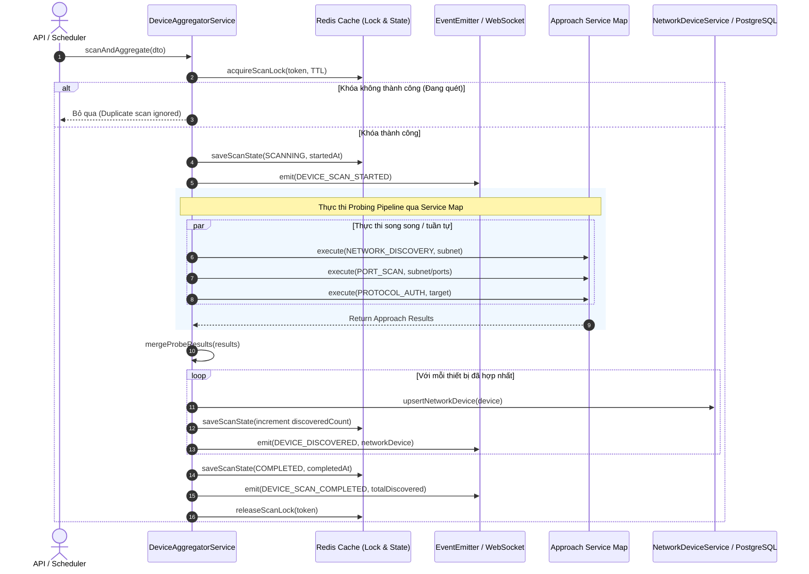

# Concept: Kiến trúc Service Map theo 3 Hướng Tiếp Cận & Tính năng Xác thực Thiết bị Mạng

## 1. Problem & Goal (Vấn đề & Mục tiêu)

### Problem (Vấn đề & Điểm nghẽn Hiện tại)
- **Bối cảnh & Điểm kích hoạt**: Module `network-device` cần quản lý toàn diện quy trình từ phát hiện thiết bị trong mạng, kiểm tra các cổng dịch vụ, cho đến xác thực tài khoản camera/thiết bị để lấy thông tin chi tiết.
- **Hiện tượng & Khiếm khuyết kỹ thuật**:
  - Các bước quét và kiểm tra hiện tại chưa được chuẩn hóa theo từng **hướng tiếp cận (Approach)** độc lập.
  - Sau khi đã có danh sách IP thiết bị, hệ thống chưa có khả năng thử nghiệm xác thực với danh sách `account / password` mẫu (dictionary check) ở tầng ứng dụng.
  - Interface chung chưa định nghĩa các **hàm chuyên biệt cho camera** (như verify credentials, lấy snapshot thumbnail, lấy RTSP stream URI, trích xuất metadata thiết bị).
  - `DeviceAggregatorService.scanAndAggregate` hiện đang inject và gọi trực tiếp các probing services rời rạc (`onvifProbeService`, `arpScanService`, `tcpPortProbeService`) một cách cứng nhắc (hard-coupled), thay vì ủy quyền qua kiến trúc `Service Map` chuẩn hóa.
- **Nguyên nhân cốt lõi (Root Cause)**: Chưa tổ chức các dịch vụ theo **Strategy Pattern & Service Map theo 3 Hướng Tiếp Cận (3 Approaches)** tương tự mô hình `DATA_PROVIDER_FEATURE_SERVICE_MAP` trong `DataProviderModule`, và chưa có các camera contracts chuẩn hóa.
- **Tác động (Impact / Blast Radius)**:
  - Khó kiểm thử độc lập từng tầng chức năng.
  - Thiếu khả năng tự động xác thực và thu thập ảnh snapshot/metadata của camera sau khi quét ra IP.
  - Bộ điều phối tổng thể (`DeviceAggregatorService`) bị dính chặt vào các implementation cụ thể thay vì mở rộng linh hoạt theo Service Map.

### Goal (Mục tiêu Kỹ thuật Cần đạt)
- **Mục tiêu cốt lõi**:
  1. Tổ chức toàn bộ tính năng của module `network-device` thành **3 Hướng Tiếp Cận (3 Approaches)** thông qua `NETWORK_DEVICE_APPROACH_SERVICE_MAP`.
  2. Xây dựng dịch vụ **`ProtocolAuthApproachService` (Tầng Ứng dụng & Xác thực)** hỗ trợ nhận vào IP và danh sách `account / password` mẫu để xác thực camera/thiết bị, lấy metadata và ảnh snapshot.
  3. Bổ sung trực tiếp các **Camera Functions** vào interface `INetworkDeviceApproachService` (như `verifyCameraCredentials`, `fetchSnapshot`, `fetchStreamUri`, `fetchDeviceInfo`) để chuẩn hóa thao tác với camera.
  4. Chuẩn hóa bộ điều phối **`DeviceAggregatorService`** để chạy chuỗi pipeline tổng hợp (Discovery $\rightarrow$ Port Scan $\rightarrow$ Protocol Auth) thông qua `NETWORK_DEVICE_APPROACH_SERVICE_MAP`, đồng thời duy trì toàn vẹn cơ chế **Distributed Lock**, **Scan State Cache** và **WebSocket Realtime Streaming**.
  5. Cho phép gọi thử nghiệm **độc lập từng hướng tiếp cận** hoặc **chạy chuỗi tổng hợp (Pipeline)** từ Discovery $\rightarrow$ Port Scan $\rightarrow$ Protocol Auth.
- **Tiêu chí nghiệm thu (Acceptance Criteria)**:
  - Định nghĩa chuẩn `INetworkDeviceApproachService` bao gồm cả hàm thực thi chung (`execute`) và các camera functions chuyên biệt.
  - Cung cấp đủ 3 service đại diện cho 3 hướng tiếp cận:
    1. `NetworkDiscoveryApproachService` (Layer 2/3 - Quét ARP/Subnet).
    2. `PortScanApproachService` (Layer 4 - Quét mở cổng TCP).
    3. `ProtocolAuthApproachService` (Layer 7 - Xác thực Protocol/ONVIF với account/password mẫu).
  - Có endpoint `POST /network-device/approach/execute` để chạy thử nghiệm 1 hướng tiếp cận bất kỳ với target IP và options.
  - `ProtocolAuthApproachService` hỗ trợ danh sách credentials mặc định (Default Dictionary) và cho phép truyền danh sách credentials tùy chỉnh qua DTO.
  - Khi xác thực thành công, trích xuất và trả về: Tài khoản hợp lệ, thông tin thiết bị (Hãng, Model, Firmware), URL RTSP stream, và ảnh Snapshot preview.
  - `DeviceAggregatorService.scanAndAggregate` tích hợp mượt mà với `NETWORK_DEVICE_APPROACH_SERVICE_MAP`, đảm bảo cơ chế `Distributed Lock` (ngăn duplicate scan), cập nhật trạng thái scan vào Cache và phát realtime events qua WebSocket (`SCAN_STARTED`, `DEVICE_DISCOVERED`, `SCAN_COMPLETED`/`FAILED`).

---

## 2. Scope Boundaries (Ranh giới Phạm vi)

### In-Scope
1. **Kiến trúc 3 Hướng Tiếp Cận (3 Approaches)**:
   - **`NetworkDeviceApproachEnum`**:
     - `NETWORK_DISCOVERY` (Tầng Mạng): Quét tìm IP, MAC, OUI Vendor trong subnet.
     - `PORT_SCAN` (Tầng Cổng): Quét trạng thái các port TCP dịch vụ (80, 554, 8000, 8080...).
     - `PROTOCOL_AUTH` (Tầng Ứng dụng & Xác thực): Giao tiếp ONVIF/RTSP, thử danh sách account/password mẫu để xác thực và lấy snapshot/metadata.
2. **Generic Contracts, Camera Functions & Service Map**:
   - `INetworkDeviceApproachService<TOptions, TResult>`: Interface chung duy nhất cho cả 3 approach, tích hợp các method camera functions.
   - `INetworkDeviceTarget`: Cấu trúc mục tiêu (`ip`, `mac`, `ports`, `credentials`, `subnet`...).
   - `INetworkDeviceApproachResult<T>`: Cấu trúc kết quả chuẩn hóa (`isSuccess`, `approach`, `data`, `matchedCredential`, `responseTimeMs`...).
   - `NETWORK_DEVICE_APPROACH_SERVICE_MAP`: NestJS Factory Provider liên kết Enum với 3 Approach Services.
3. **Bộ điều phối (DeviceAggregatorService & Lifecycle Pipeline)**:
   - Tích hợp `NETWORK_DEVICE_APPROACH_SERVICE_MAP` để điều phối pipeline.
   - **Distributed Lock Management**: Sử dụng Redis Lock (`setIfNotExists` & `releaseLock` với TTL) tránh xung đột scan đồng thời trên cluster.
   - **State Cache Tracking**: Quản lý vòng đời trạng thái quét (`IDLE` $\rightarrow$ `SCANNING` $\rightarrow$ `COMPLETED` / `FAILED`) trên Redis Cache.
   - **WebSocket Realtime Events**: Phát các sự kiện `DEVICE_SCAN_STARTED`, `DEVICE_DISCOVERED` (từng thiết bị khi upsert), `DEVICE_SCAN_COMPLETED`.
   - **Result Aggregation & Merging**: Hợp nhất thông tin đa tầng (ARP MAC + TCP Open Ports + ONVIF Metadata / Auth) và lưu vào cơ sở dữ liệu (`upsertNetworkDevice`).
4. **API Endpoints**:
   - `POST /network-device/approach/execute`: Chạy thử nghiệm độc lập 1 hướng tiếp cận.
   - `POST /network-device/scan/trigger`: Kích hoạt quét và tổng hợp toàn bộ mạng qua `DeviceAggregatorService.scanAndAggregate`.

### Explicit Out-of-Scope
- Transcoding video stream thời gian thực (WebRTC / HLS server).
- Điều khiển quay quét camera vật lý (PTZ control).

---

## 3. Proposed Architecture & Core Contracts

### 3.1. Sơ đồ 3 Hướng Tiếp Cận trong Service Map

```
                     ┌───────────────────────────────┐
                     │      Controller / Client      │
                     └───────────────┬───────────────┘
                                     │
                                     ▼
                     ┌───────────────────────────────┐
                     │   DeviceAggregatorService     │
                     │    (Orchestrator Pipeline)    │
                     └───────────────┬───────────────┘
                                     │
                                     ▼
            ┌─────────────────────────────────────────────────┐
            │       NETWORK_DEVICE_APPROACH_SERVICE_MAP       │
            ├─────────────────────────────────────────────────┤
            │ [NETWORK_DISCOVERY] : NetworkDiscoveryApproachService │
            │                       (Layer 2/3 - ARP / MAC)   │
            │                                                 │
            │ [PORT_SCAN]         : PortScanApproachService   │
            │                       (Layer 4 - TCP Ports)     │
            │                                                 │
            │ [PROTOCOL_AUTH]     : ProtocolAuthApproachService│
            │                       (Layer 7 - ONVIF & Auth)  │
            └─────────────────────────────────────────────────┘
```

### 3.2. Cấu trúc Interface & Data Contracts (Tích hợp Camera Functions)

```typescript
export enum NetworkDeviceApproachEnum {
    NETWORK_DISCOVERY = 'NETWORK_DISCOVERY',
    PORT_SCAN = 'PORT_SCAN',
    PROTOCOL_AUTH = 'PROTOCOL_AUTH',
}

export interface IDeviceCredential {
    username: string;
    password?: string;
}

export interface INetworkDeviceTarget {
    ip?: string;
    mac?: string;
    subnet?: string;
    ports?: number[];
    credentials?: IDeviceCredential[];
}

export interface ICameraDeviceInfo {
    manufacturer?: string;
    model?: string;
    firmwareVersion?: string;
    serialNumber?: string;
    hardwareId?: string;
}

export interface ICameraVerificationData {
    deviceInfo?: ICameraDeviceInfo;
    snapshotUri?: string;
    snapshotBase64?: string;
    rtspStreamUri?: string;
    liveViewSupported?: boolean;
}

export interface INetworkDeviceApproachResult<TData = any> {
    isSuccess: boolean;
    approach: NetworkDeviceApproachEnum;
    target: INetworkDeviceTarget;
    matchedCredential?: IDeviceCredential;
    data?: TData;
    responseTimeMs: number;
    errorMessage?: string;
}

/**
 * Interface chung cho 3 hướng tiếp cận, tích hợp các Camera Functions chuyên biệt
 */
export interface INetworkDeviceApproachService<TOptions = any, TResult = any> {
    /**
     * Hàm thực thi cốt lõi của hướng tiếp cận
     */
    execute(
        target: INetworkDeviceTarget,
        options?: TOptions,
    ): Promise<INetworkDeviceApproachResult<TResult>>;

    /**
     * Camera Function: Xác thực danh sách account & password mẫu
     */
    verifyCameraCredentials?(
        target: INetworkDeviceTarget,
        credentials?: IDeviceCredential[],
    ): Promise<INetworkDeviceApproachResult<ICameraVerificationData>>;

    /**
     * Camera Function: Lấy ảnh chụp nhanh hiện tại (Snapshot preview)
     */
    fetchSnapshot?(
        target: INetworkDeviceTarget,
        credential?: IDeviceCredential,
    ): Promise<string | null>;

    /**
     * Camera Function: Lấy đường dẫn luồng phát video trực tiếp (RTSP Stream URI)
     */
    fetchStreamUri?(
        target: INetworkDeviceTarget,
        credential?: IDeviceCredential,
    ): Promise<string | null>;

    /**
     * Camera Function: Trích xuất thông tin chi tiết camera (Hãng, Model, Firmware)
     */
    fetchDeviceInfo?(
        target: INetworkDeviceTarget,
        credential?: IDeviceCredential,
    ): Promise<ICameraDeviceInfo | null>;
}
```

### 3.3. Cấu hình NestJS Module Provider

```typescript
export const NETWORK_DEVICE_APPROACH_SERVICE_MAP = 'NETWORK_DEVICE_APPROACH_SERVICE_MAP';

// Trong NetworkDeviceModule:
{
    provide: NETWORK_DEVICE_APPROACH_SERVICE_MAP,
    useFactory: (
        networkDiscoveryService: NetworkDiscoveryApproachService,
        portScanService: PortScanApproachService,
        protocolAuthService: ProtocolAuthApproachService,
    ): Record<NetworkDeviceApproachEnum, INetworkDeviceApproachService> => ({
        [NetworkDeviceApproachEnum.NETWORK_DISCOVERY]: networkDiscoveryService,
        [NetworkDeviceApproachEnum.PORT_SCAN]: portScanService,
        [NetworkDeviceApproachEnum.PROTOCOL_AUTH]: protocolAuthService,
    }),
    inject: [
        NetworkDiscoveryApproachService,
        PortScanApproachService,
        ProtocolAuthApproachService,
    ],
}
```

### 3.4. Chi tiết Cơ chế Điều phối của `DeviceAggregatorService.scanAndAggregate`

Quy trình vận hành chuẩn trong `DeviceAggregatorService` bao gồm 5 pha tuần tự:



#### Chi tiết các bước xử lý:
1. **Phân phối Khóa & Khởi tạo (Distributed Lock & Initial State)**:
   - Sử dụng `acquireScanLock` qua Redis `setIfNotExists` với key `NETWORK_DEVICE_SCAN_LOCK_KEY` và TTL định sẵn.
   - Nếu lock thất bại $\rightarrow$ Ghi log cảnh báo và ngắt sớm (Idempotency / Single Job Execution).
   - Thiết lập trạng thái `SCANNING` vào Redis Cache và phát sự kiện `DEVICE_SCAN_STARTED`.
2. **Thực thi Pipeline qua `NETWORK_DEVICE_APPROACH_SERVICE_MAP`**:
   - Sử dụng các services từ Service Map để thực hiện quét theo từng tầng (Discovery $\rightarrow$ Port Scan $\rightarrow$ Protocol Auth).
   - Đảm bảo xử lý lỗi độc lập cho từng approach (Fault Tolerance): Một approach gặp lỗi không làm crash toàn bộ pipeline.
3. **Tổng hợp & Hợp nhất Dữ liệu (Merge Logic)**:
   - Kết quả từ các approach được gom nhóm theo IP qua `mergeProbeResults`.
   - Kết hợp thông tin MAC, Vendor từ Discovery; Open Ports từ Port Scan; và Camera Model, Firmware, ONVIF Endpoints từ Protocol Auth.
4. **Lưu trữ & Phát sóng Thiết bị Phát hiện (Persist & Realtime Streaming)**:
   - Với từng thiết bị sau khi merge: Lưu vào database qua `NetworkDeviceService.upsertNetworkDevice`.
   - Cập nhật số lượng thiết bị phát hiện (`devicesDiscoveredCount`) vào Cache.
   - Phát sự kiện WebSocket `DEVICE_DISCOVERED` để client nhận dữ liệu tức thời (progressive discovery).
5. **Hoàn tất & Giải phóng Tài nguyên (Finalization & Teardown)**:
   - Cập nhật trạng thái `COMPLETED` (hoặc `FAILED` nếu có lỗi nghiêm trọng) kèm `completedAt` với TTL thích hợp.
   - Phát sự kiện `DEVICE_SCAN_COMPLETED`.
   - Trong khối `finally`: Luôn gọi `releaseScanLock` để giải phóng khóa phân tán.

---

## 4. Critical Risks & Edge Cases (Rủi ro & Kịch bản Biên)

1. **Khóa tài khoản thiết bị (Account Lockout)**:
   - Thử sai nhiều mật khẩu liên tiếp có thể khiến camera tạm khóa IP.
   - *Giải pháp*: Áp dụng delay giữa các lần thử và giới hạn số lượng credentials thử nghiệm trong một lần probe.
2. **Quản lý Timeout độc lập cho từng Approach & Camera Function**:
   - `NETWORK_DISCOVERY`: Timeout theo chu kỳ quét ARP.
   - `PORT_SCAN`: Timeout nhanh (200-500ms per port) để tránh nghẽn.
   - `PROTOCOL_AUTH` / Camera Functions: Timeout 1500-2000ms cho mỗi lần bắt tay ONVIF/Snapshot.
3. **Tính độc lập & Khả năng thử nghiệm (Testability)**:
   - Mỗi Approach Service có thể chạy hoàn toàn độc lập với input từ request body mà không phụ thuộc vào kết quả của các approach khác.
4. **Xử lý Khóa Phân tán & Deadlock trong `scanAndAggregate`**:
   - Nếu tiến trình scan bị crash giữa chừng, khóa Redis cần tự động hết hạn thông qua TTL (`NETWORK_DEVICE_SCAN_LOCK_TTL_SECONDS`).
   - Khối `finally` bắt buộc giải phóng lock an toàn với đúng `lockToken`.
5. **Fault Tolerance trong Pipeline**:
   - Nếu một approach (ví dụ: `ONVIF` hoặc `PORT_SCAN`) thất bại do timeout mạng, pipeline vẫn tổng hợp kết quả từ các approach thành công còn lại (ví dụ: `ARP Discovery`) thay vì đánh dấu toàn bộ quá trình là `FAILED`.
