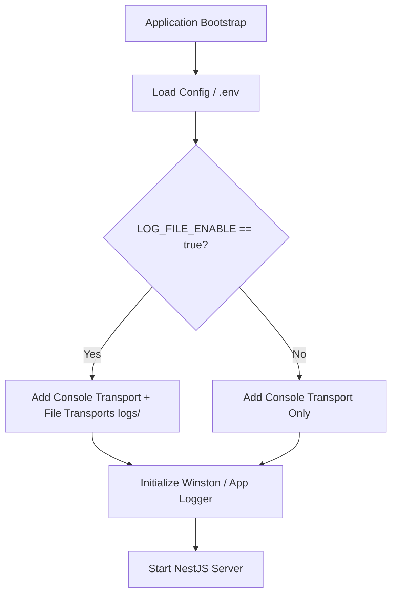

# Concept: Cơ chế Bật / Tắt Ghi File Logs (Toggle File Logging)

## 1. Problem & Goal (Vấn đề & Mục tiêu)

### Problem (Vấn đề & Điểm nghẽn Hiện tại)
- **Bối cảnh & Điểm kích hoạt**: Hệ thống backend `only-one-be` đang cấu hình ghi logs vào thư mục [logs/](file:///Users/kiem/Sources/PERSONAL/only-one-be/logs) (file transport).
- **Hiện tượng & Khiếm khuyết kỹ thuật**: Việc ghi log ra file chạy mặc định và không có cơ chế bật/tắt (toggle) linh hoạt theo từng môi trường triển khai (Local, Staging, Production, CI/CD, Containerized environment).
- **Nguyên nhân cốt lõi (Root Cause)**: Logger transport configuration được khởi tạo tĩnh mà chưa liên kết với cấu hình biến môi trường (`ConfigService` / `.env`) để conditionally register file transports.
- **Tác động (Impact / Blast Radius)**: 
  - Gây lãng phí tài nguyên disk I/O và dung lượng ổ cứng không cần thiết trên các môi trường chỉ yêu cầu log qua stdout/stderr (như Docker/Kubernetes container logging).
  - Khó kiểm soát việc tạo file rác trong môi trường local development hoặc CI test pipeline.

### Goal (Mục tiêu Kỹ thuật Cần đạt)
- **Mục tiêu cốt lõi**: Cung cấp cơ chế điều khiển bật/tắt việc ghi log ra file trong thư mục `logs/` thông qua biến môi trường (ví dụ: `LOG_FILE_ENABLE` hoặc `ENABLE_FILE_LOGGING`) mà không làm ảnh hưởng đến Console logging.
- **Tiêu chí nghiệm thu (Acceptance Criteria)**:
  - Khi cấu hình biến môi trường bật file logging (`LOG_FILE_ENABLE=true`): Logger khởi tạo file transport và ghi log vào thư mục `logs/` bình thường.
  - Khi cấu hình biến môi trường tắt file logging (`LOG_FILE_ENABLE=false`): Logger bỏ qua file transport, không tạo/ghi file log vào thư mục `logs/`.
  - Console logging (stdout/stderr) luôn hoạt động độc lập và không bị tắt khi tắt file logging.
  - Xử lý giá trị mặc định (fallback default) an toàn nếu biến môi trường không được thiết lập.

---

## 2. Scope Boundaries (Ranh giới Phạm vi)

- **In-Scope**:
  - Khai báo và validate biến môi trường điều khiển file logging (`LOG_FILE_ENABLE` hoặc tương đương) trong schema cấu hình của backend.
  - Cập nhật logic khởi tạo Logger module / Logger transports để conditionally kích hoạt file transport.
  - Cập nhật tài liệu cấu hình môi trường mẫu (`.env.sample` / `.env.example`).
- **Explicit Out-of-Scope**:
  - Không tắt hoặc can thiệp luồng Console logging (Console log luôn bật để phục vụ quan sát thời gian thực).
  - Không xây dựng API runtime dynamic toggle qua HTTP endpoint (chỉ áp dụng khởi tạo theo biến môi trường lúc boot ứng dụng).
  - Không thay đổi cấu trúc định dạng log (log format) hay cơ chế log rotation hiện hữu.

---

## 3. Proposed Solution & Core Mechanism (Giải pháp Đề xuất & Cơ chế)

### Phân tích các phương án (Solution Options)

| Tiêu chí | Option 1: Direct Env Flag (Khuyên dùng) | Option 2: Dynamic Runtime Toggle via Service | Option 3: Transport Log-Level Mapping |
| :--- | :--- | :--- | :--- |
| **Mô tả** | Đọc cờ `LOG_FILE_ENABLE` (boolean) lúc bootstrap để quyết định nạp File Transport vào Winston/Logger instance. | Cung cấp ConfigService state có thể toggle qua Admin API / Memory flag. | Sử dụng log level `silent` cho file transport khi tắt log. |
| **Ưu điểm** | Đơn giản, tường minh, chuẩn 12-Factor App, không tốn memory overhead, an toàn khi chạy container. | Thay đổi được log state mà không cần restart server. | Giữ nguyên cấu trúc logger pipeline. |
| **Nhược điểm** | Cần restart tiến trình khi thay đổi cấu hình. | Tăng độ phức tạp, rủi ro security nếu API toggle không được bảo vệ chặt chẽ, không đồng bộ giữa các replica pods. | File transport vẫn được tạo và chiếm file handle dù không ghi log. |
| **Độ phức tạp** | **Thấp (Low)** | **Trung bình - Cao (Medium-High)** | **Thấp (Low)** |

$\rightarrow$ **Lựa chọn**: **Option 1: Direct Env Flag** (Tối ưu, đúng chuẩn containerization và đơn giản nhất).

### Core Mechanism (Cơ chế Vận hành)
1. **Configuration Layer**:
   - `ConfigModule` parse biến `LOG_FILE_ENABLE` từ `.env` thành kiểu dữ liệu `boolean` (hỗ trợ các giá trị `true`, `false`, `1`, `0`).
   - Thiết lập giá trị mặc định (Default: `false` hoặc `true` tùy theo chuẩn môi trường của dự án).
2. **Logger Factory / Transports Builder**:
   - Khởi tạo danh sách `transports` luôn chứa `ConsoleTransport`.
   - Kiểm tra điều kiện `if (isFileLoggingEnabled)`: thêm `FileTransport` (hoặc `DailyRotateFile`) vào danh sách transports của logger.
3. **Application Lifecycle**:
   - Logger được inject hoặc gắn vào NestJS application lifecycle với danh sách transports đã được xác định trước khi ứng dụng lắng nghe requests.

---

## 4. Critical Risks & Edge Cases (Rủi ro & Kịch bản Biên)

- **Type Coercion từ Env String sang Boolean**: Biến môi trường thường được truyền vào dưới dạng string (`"false"`, `"0"`). Cần đảm bảo parser (Joi / class-validator / helper function) không coi chuỗi `"false"` là truthy.
- **Thư mục logs/ không tồn tại khi bật**: Khi `LOG_FILE_ENABLE=true`, nếu thư mục `logs/` chưa tồn tại thì transport cần tự động tạo (auto-create dir) tránh làm crash ứng dụng khi khởi động.
- **Không ghi đè log lỗi nghiêm trọng**: Dù tắt file log thông thường, các unhandled rejection hoặc bootstrap crash vẫn phải được hiển thị đầy đủ trên Console để dev/ops xử lý kịp thời.
