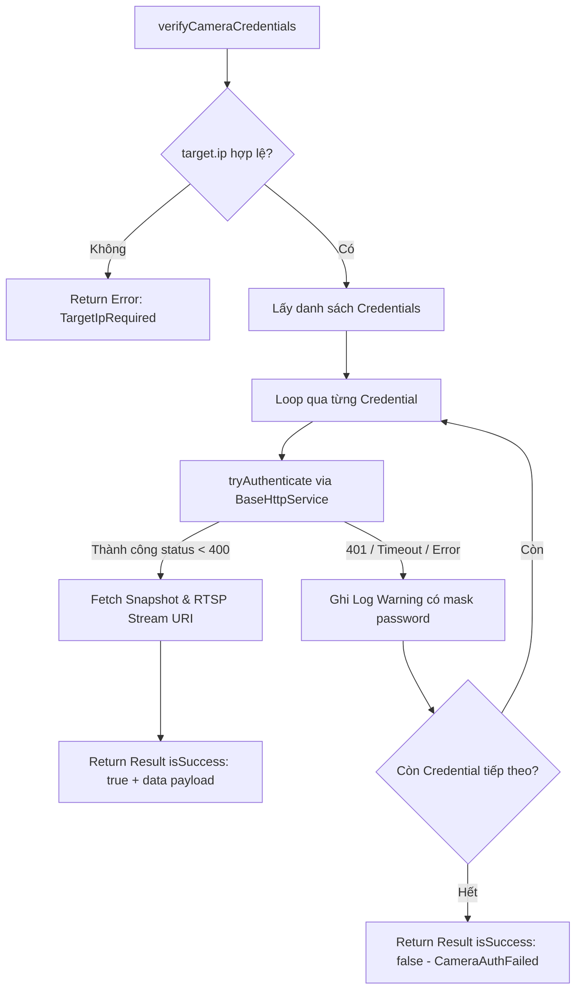

# Concept: Cải tiến ProtocolAuthApproachService (BaseHttpService, Error Handling & Constants)

## 1. Problem & Goal (Vấn đề & Mục tiêu)

### Problem (Vấn đề & Điểm nghẽn Hiện tại)
- **Bối cảnh & Điểm kích hoạt**: Module [network-device](file:///Users/kiem/Sources/PERSONAL/only-one-be/src/modules/network-device) sử dụng [ProtocolAuthApproachService](file:///Users/kiem/Sources/PERSONAL/only-one-be/src/modules/network-device/services/network-device-approach/protocol-auth-approach.service.ts) để dò quét thiết bị chuẩn ONVIF và thực hiện xác thực/lấy thông tin hình ảnh (snapshot/stream) từ Camera IP.
- **Hiện tượng & Khiếm khuyết kỹ thuật**:
  1. **Direct Axios Dependency**: Service đang import và gọi trực tiếp `axios.get(...)` ở các hàm `tryAuthenticate` và `fetchSnapshot`, đi ngược lại kiến trúc chuẩn của hệ thống là sử dụng [BaseHttpService](file:///Users/kiem/Sources/PERSONAL/only-one-be/src/shared/services/base-http.service.ts) (thiếu tính đồng nhất về interceptors, timeout, proxy config và khả năng mock khi unit test).
  2. **Error Handling sơ sài / Silent Swallowing**: Các khối `catch` trong `tryAuthenticate` và `fetchSnapshot` đang swallow lỗi hoàn toàn (`// Tiếp tục thử...`, `// Bỏ qua lỗi kết nối`) mà không phân loại nguyên nhân (Timeout, Network Unreachable / Connection Refused, HTTP 401 Unauthorized, HTTP 404 Not Found, Invalid MIME Type/Corrupted Buffer).
  3. **Hardcoded Magic Values**: Tồn tại nhiều magic strings & numbers rải rác: danh sách probe endpoints (`/onvif/device_service`, `/cgi-bin/snapshot.cgi`, `/`), danh sách snapshot paths (`/onvif-http/snapshot`, `/snap.jpg`, `/image.jpg`), timeout cứng (`1500ms`, `2000ms`), cổng RTSP (`554`), RTSP path template (`/live/ch0`), fallback content-type (`image/jpeg`), UDP multicast TTL (`128`).
  4. **Thông điệp lỗi bị hardcode**: Các message trả về trong `INetworkDeviceApproachResult` đang bị hardcode chuỗi string trực tiếp thay vì quản lý tập trung trong [NetworkDeviceError](file:///Users/kiem/Sources/PERSONAL/only-one-be/src/modules/network-device/constants/network-device-error.ts).
- **Tác động (Impact / Blast Radius)**:
  - Khó debug và theo dõi khi camera từ chối xác thực hoặc timeout do thiếu log chi tiết có ngữ cảnh.
  - Rủi ro leak credentials nếu log ghi trực tiếp mật khẩu camera khi xảy ra ngoại lệ.
  - Khó bảo trì, mở rộng thêm các vendor paths mới hoặc điều chỉnh timeout theo môi trường.

### Goal (Mục tiêu Kỹ thuật Cần đạt)
- **Mục tiêu cốt lõi**: Tái cấu trúc [ProtocolAuthApproachService](file:///Users/kiem/Sources/PERSONAL/only-one-be/src/modules/network-device/services/network-device-approach/protocol-auth-approach.service.ts) theo kiến trúc chuẩn NestJS: áp dụng `BaseHttpService`, chuẩn hóa toàn bộ error handling và chuyển đổi tất cả magic values thành hằng số (constants) có cấu trúc.
- **Tiêu chí nghiệm thu (Acceptance Criteria)**:
  - Loại bỏ hoàn toàn `import axios from 'axios'` trong `ProtocolAuthApproachService`, chuyển sang inject và sử dụng [BaseHttpService](file:///Users/kiem/Sources/PERSONAL/only-one-be/src/shared/services/base-http.service.ts).
  - Khởi tạo file hằng số riêng biệt (e.g. `protocol-auth.constant.ts`) chứa toàn bộ paths, timeouts, ports, defaults và export qua `constants/index.ts`.
  - Bổ sung và chuẩn hóa các mã lỗi liên quan vào [NetworkDeviceError](file:///Users/kiem/Sources/PERSONAL/only-one-be/src/modules/network-device/constants/network-device-error.ts).
  - Phân loại và xử lý ngoại lệ rõ ràng (Granular Error Handling): log debug/warn có cấu trúc kèm IP/Path (che giấu password để bảo mật), không để unhandled rejections làm sập tiến trình, phân biệt rõ lỗi timeout vs lỗi sai thông tin đăng nhập.
  - Đảm bảo giữ nguyên contract kết quả trả về `INetworkDeviceApproachResult<ICameraVerificationData>`, không làm ảnh hưởng đến các service gọi đến như [DeviceAggregatorService](file:///Users/kiem/Sources/PERSONAL/only-one-be/src/modules/network-device/services/device-aggregator.service.ts).

---

## 2. Scope Boundaries (Ranh giới Phạm vi)

- **In-Scope**:
  - Refactor [ProtocolAuthApproachService](file:///Users/kiem/Sources/PERSONAL/only-one-be/src/modules/network-device/services/network-device-approach/protocol-auth-approach.service.ts) để inject `BaseHttpService`.
  - Tạo mới file `src/modules/network-device/constants/protocol-auth.constant.ts` và export tại `constants/index.ts`.
  - Cập nhật [NetworkDeviceError](file:///Users/kiem/Sources/PERSONAL/only-one-be/src/modules/network-device/constants/network-device-error.ts) với các định nghĩa lỗi mới cho authentication / approach validation.
  - Cải tiến error handling & logging cho các hàm `scan`, `verifyCameraCredentials`, `tryAuthenticate`, `fetchSnapshot`, `fetchStreamUri`.
- **Explicit Out-of-Scope**:
  - Không thay đổi interface `INetworkDeviceApproachService` hay kiểu dữ liệu DTO/Interface hiện hữu.
  - Không thay đổi cơ chế quét UDP Multicast dgram của ONVIF Discovery sang HTTP (UDP socket là giao thức bắt buộc của chuẩn WS-Discovery Probe).
  - Không can thiệp vào các approach service khác (`NetworkDiscoveryApproachService`, `PortScanApproachService`).

---

## 3. Proposed Solution & Core Mechanism (Giải pháp Đề xuất & Cơ chế)

### Phân tích các phương án (Solution Options)

| Tiêu chí | Option 1: Inject BaseHttpService + Protocol Constants (Khuyên dùng) | Option 2: Tạo Wrapper Dedicated CameraHttpClient | Option 3: Giữ Axios và chỉ gom Constants |
| :--- | :--- | :--- | :--- |
| **Mô tả** | Inject `BaseHttpService` trực tiếp vào `ProtocolAuthApproachService`, tổ chức constants vào `protocol-auth.constant.ts` và chuẩn hóa error handling. | Tạo một helper/service riêng `CameraHttpClientService` bọc `BaseHttpService` xử lý riêng logic digest/basic auth và binary data. | Giữ nguyên direct `axios` dependency, chỉ gom các magic strings/numbers thành constants và thêm try/catch. |
| **Ưu điểm** | - Đơn giản, tuân thủ kiến trúc `@Global() SharedModule`.<br>- Tận dụng cấu hình HTTP của ứng dụng.<br>- Dễ dàng mock test.<br>- Code sạch, không over-engineering. | Tách biệt hoàn toàn domain HTTP client của camera với shared HTTP client. | Rủi ro thay đổi hành vi thấp nhất vì không đổi underlying HTTP caller. |
| **Nhược điểm** | Cần đảm bảo `BaseHttpService` truyền tải đúng `responseType: 'arraybuffer'` cho snapshot. | Tạo thêm tầng abstraction không cần thiết khi chỉ có 1 service sử dụng. | Vẫn vi phạm nguyên tắc kiến trúc (direct library coupling), khó mock khi viết unit tests. |
| **Độ phức tạp** | **Thấp - Vừa phải (Low - Medium)** | **Trung bình - Cao (Medium - High)** | **Rất thấp (Very Low)** |

$\rightarrow$ **Lựa chọn**: **Option 1: Inject BaseHttpService + Protocol Constants** (Đảm bảo tính nhất quán trong codebase, dễ maintain và test).

---

### Core Mechanism & Design Details

#### 1. Cấu trúc Constants (`protocol-auth.constant.ts`)
```typescript
export const DEFAULT_PROTOCOL_AUTH_TIMEOUT_MS = 1500;
export const DEFAULT_SNAPSHOT_TIMEOUT_MS = 2000;
export const DEFAULT_RTSP_PORT = 554;
export const DEFAULT_RTSP_PATH = '/live/ch0';
export const DEFAULT_SNAPSHOT_CONTENT_TYPE = 'image/jpeg';
export const ONVIF_MULTICAST_TTL = 128;

export const CAMERA_AUTH_PROBE_PATHS: readonly string[] = [
  '/onvif/device_service',
  '/cgi-bin/snapshot.cgi',
  '/',
];

export const CAMERA_SNAPSHOT_PATHS: readonly string[] = [
  '/onvif-http/snapshot',
  '/cgi-bin/snapshot.cgi',
  '/snap.jpg',
  '/image.jpg',
];
```

#### 2. Chuẩn hóa Error Constants (`network-device-error.ts`)
```typescript
static readonly TargetIpRequired: IAppError = {
  code: 'network_device_target_ip_required',
  message: 'Target IP bắt buộc phải được cung cấp để xác thực thiết bị.',
  statusCode: HttpStatus.BAD_REQUEST,
};

static readonly CameraAuthFailed: IAppError = {
  code: 'network_device_camera_auth_failed',
  message: 'Không có tài khoản / mật khẩu nào xác thực thành công.',
  statusCode: HttpStatus.UNAUTHORIZED,
};
```

#### 3. Data & Error Flow



---

## 4. Critical Risks & Edge Cases (Rủi ro & Kịch bản Biên)

1. **Xử lý Binary Stream / ArrayBuffer trong BaseHttpService**:
   - Khi tải snapshot camera với `responseType: 'arraybuffer'`, `BaseHttpService` trả về `AxiosResponse<ArrayBuffer>`. Cần đảm bảo chuyển đổi sang Base64 chuẩn `Buffer.from(res.data).toString('base64')` mà không bị lỗi type casting.
2. **An toàn bảo mật thông tin (Credential Masking)**:
   - Khi ghi log lỗi hoặc cảnh báo xác thực thất bại, chỉ log `username` và che mask `password` (e.g. `***`) để tránh lộ lọt thông tin nhạy cảm vào file log / console.
3. **Phân biệt HTTP 401 Unauthorized vs Network Timeout / Unreachable**:
   - `tryAuthenticate` sử dụng `validateStatus: (status) => status < 400 || status === 401`. Status 401 biểu thị thiết bị tồn tại nhưng sai tài khoản, trong khi timeout/ECONNREFUSED biểu thị không có dịch vụ HTTP trên endpoint đó.
4. **Socket Resource Cleanup trong `scan()`**:
   - Đảm bảo `dgram` socket luôn được đóng trong khối `cleanup()` dù xảy ra exception khi parse XML hoặc khi hết timeout.
